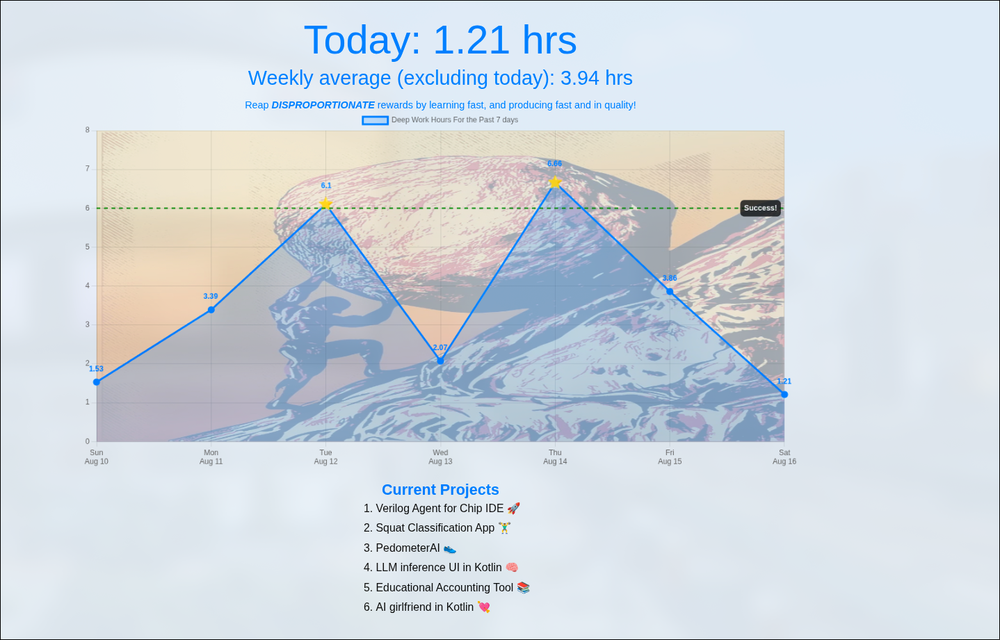

Built for accountability and deep work.

This site auto-updates hourly to reflect deep work time if my PC is on. Powered by a local tracker + GitHub Pages.

# Work Tracking Setup Guide

This guide explains how to set up a simple system that tracks your work sessions, logs them to a CSV file, and automatically publishes the results to your personal GitHub Pages website. The idea is to keep a lightweight workflow that helps visualize how much focused work you’ve been doing.

---

## 1. Prepare a CSV file for session logs

You’ll need a `.csv` file that records the **start** and **finish** timestamps of each session. This file will act as the central log for your work tracking.

- A typical row in the file might look like this:

timestamp,startOrFinish
2025-07-15 19:39:13,start
2025-07-15 19:42:58,finish

- You can see an example CSV format in my [`fireOverlay`](https://github.com/DmytroIvakhnenkov/fireOverlay) repository.

Make sure to create this file somewhere easy to access, since all your scripts will write to it.

---

## 2. Set up keybinds to toggle work mode

To track when you begin and end a session, you’ll need to create keybindings that trigger small Python scripts.

- For example:
- **Start working:** `CMD/Windows Key + SHIFT + D`
- **Finish working:** `CMD/Windows Key + ALT + D`

These key combinations are bound to two Python scripts:

- `startWork.py` → appends a new line with a start timestamp into the CSV.
- `endWork.py` → updates the corresponding line with a finish timestamp.

You can find working examples of both scripts in the [`fireOverlay`](https://github.com/DmytroIvakhnenkov/fireOverlay) repository.

> 💡 Depending on your operating system, you may use tools like **AutoHotkey (Windows)**, **Karabiner (Mac)**, or native keybinding utilities to map these shortcuts to your Python scripts.

---

## 3. Automate processing with a scheduled job

To keep your GitHub repository up to date, set up an automated job that runs **once per hour**:

- On **Windows**, use **Task Scheduler**.
- On **Linux/Mac**, use a **cron job**.

The scheduled task should run the `cronJob.py` script, which:

1. Processes your CSV log file.
2. Commits the updated data to your repository.
3. Pushes the changes to GitHub automatically.

This ensures your personal work tracking website always has fresh data without requiring you to manually push changes.

---

## 4. Host the data on GitHub Pages

Finally, enable GitHub Pages on the repository:

1. Go to your repository settings.
2. Scroll to **Pages**.
3. Select the branch (e.g., `main`) and root folder for publishing.
4. Save, and GitHub will provide you with a `https://yourusername.github.io/repository-name` link.

This will serve your work tracking website, where you can visualize your sessions and progress over time.

---

## Summary

- **CSV file** → stores all your session logs.
- **Keybinds + Python scripts** → let you mark start/stop times instantly.
- **Cron job / Task Scheduler** → keeps everything updated automatically.
- **GitHub Pages** → makes your progress publicly visible.

With this setup, you’ll have a lightweight, automated system to log your deep work sessions and view your progress online.

